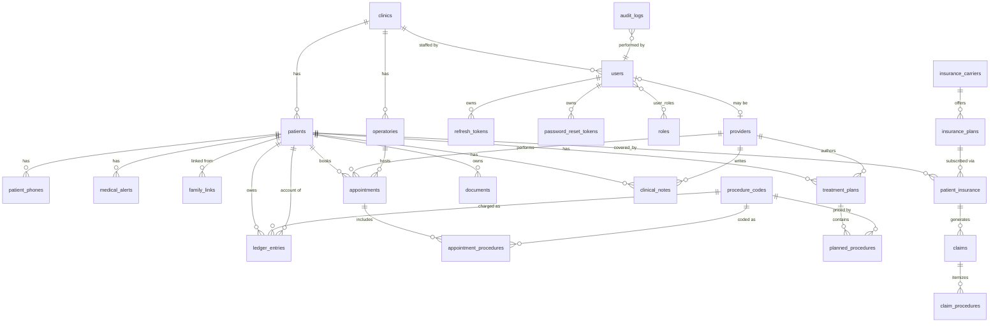

# DentalCore PMS — Database Design

PostgreSQL 16, Flyway-managed. One migration set, schema `public`.

## Conventions

- **PKs**: `id UUID PRIMARY KEY DEFAULT gen_random_uuid()` everywhere (multi-clinic merge-safe,
  non-enumerable, safe in URLs).
- **Timestamps**: every table has `created_at TIMESTAMPTZ NOT NULL DEFAULT now()` and
  `updated_at TIMESTAMPTZ NOT NULL DEFAULT now()` (maintained by Hibernate `@CreationTimestamp`/`@UpdateTimestamp`).
- **Soft deletes**: clinical/financial tables carry `deleted_at TIMESTAMPTZ NULL` (null = live).
  Hibernate `@SQLRestriction("deleted_at IS NULL")`. Identity/audit/token tables are hard-delete
  or append-only by design.
- **Enums**: stored as `VARCHAR` + CHECK constraints (avoids Postgres enum migration pain).
- **Money**: `NUMERIC(10,2)`. Never floats.
- **Multi-clinic**: `clinic_id UUID NOT NULL REFERENCES clinics(id)` on all operational tables.
- **Optimistic locking**: `version BIGINT NOT NULL DEFAULT 0` on mutable aggregates
  (appointments, ledger, treatment plans).

## ERD



## Tables (summary — full DDL in Flyway migrations)

### Identity & Access
| Table | Key columns | Notes |
|---|---|---|
| `clinics` | name, address, phone, timezone | Seeded with default clinic |
| `users` | email (uniq), password_hash, first/last name, status, idp_subject NULL, failed_attempts, locked_until | Soft status, not soft delete |
| `roles` | name (uniq) | 6 seeded roles |
| `user_roles` | user_id, role_id | composite uniq |
| `refresh_tokens` | user_id, token_hash (uniq), family_id, expires_at, revoked_at | rotation + reuse detection |
| `password_reset_tokens` | user_id, token_hash, expires_at, used_at | single-use |

### Patient Care
| Table | Key columns | Notes |
|---|---|---|
| `patients` | clinic_id, first/middle/last name, dob, sex, email, address fields, preferred_language, status, emergency_contact_*, notes, deleted_at | status: ACTIVE/INACTIVE/ARCHIVED; trigram index on names for search |
| `patient_phones` | patient_id, type (HOME/MOBILE/WORK), number, is_primary | |
| `medical_alerts` | patient_id, type (ALLERGY/CONDITION/ALERT), description, severity, active | |
| `family_links` | patient_id, related_patient_id, relationship (GUARANTOR/SPOUSE/CHILD/PARENT/OTHER) | uniq pair |
| `providers` | clinic_id, user_id NULL, type (DENTIST/HYGIENIST/ASSISTANT), first/last name, npi (uniq), specialty, license_number, license_state, email, phone, color, active, deleted_at | color drives calendar coding |

### Scheduling
| Table | Key columns | Notes |
|---|---|---|
| `operatories` | clinic_id, name, active | chairs/rooms |
| `appointments` | clinic_id, patient_id, provider_id, operatory_id, starts_at, ends_at, status, notes, color_override, cancelled_reason, version, deleted_at | status CHECK; **conflict prevention**: GiST exclusion constraints on (provider_id, tstzrange) and (operatory_id, tstzrange) for non-cancelled rows |
| `appointment_procedures` | appointment_id, procedure_code_id | planned work for the visit |

### Clinical
| Table | Key columns | Notes |
|---|---|---|
| `procedure_codes` | code (uniq), description, category, standard_fee, cdt_code NULL, active | CDT-ready |
| `treatment_plans` | clinic_id, patient_id, provider_id, title, status (DRAFT/PRESENTED/APPROVED/IN_PROGRESS/COMPLETED/CANCELLED), approved_at, approved_by, deleted_at | |
| `planned_procedures` | treatment_plan_id, procedure_code_id, tooth, surface, priority (1..n), status (PLANNED/SCHEDULED/COMPLETED/CANCELLED), estimated_cost, completed_at | |
| `clinical_notes` | patient_id, provider_id, appointment_id NULL, note_type, body, signed_at, deleted_at | immutable once signed |

### Revenue Cycle
| Table | Key columns | Notes |
|---|---|---|
| `insurance_carriers` | name, payer_id, phone, address, deleted_at | |
| `insurance_plans` | carrier_id, plan_name, group_number, plan_type, annual_max, deductible, coverage_notes | |
| `patient_insurance` | patient_id, plan_id, subscriber_patient_id, relationship_to_subscriber, member_id, priority (PRIMARY/SECONDARY), effective_date, termination_date, deleted_at | subscriber is itself a patient |
| `claims` | patient_insurance_id, patient_id, status (DRAFT/SUBMITTED/ACCEPTED/DENIED/PAID/CLOSED), submitted_at, total_billed, total_paid | |
| `claim_procedures` | claim_id, ledger_entry_id, billed_amount, paid_amount | |
| `ledger_entries` | clinic_id, patient_id, type (CHARGE/PAYMENT/ADJUSTMENT/INSURANCE_PAYMENT), procedure_code_id NULL, amount (signed), description, entry_date, appointment_id NULL, version | **append-only** — corrections are reversing entries; balance = SUM(amount) |

### Records & Compliance
| Table | Key columns | Notes |
|---|---|---|
| `documents` | clinic_id, patient_id NULL, category (XRAY/PHOTO/CONSENT/INSURANCE/OTHER), filename, content_type, size_bytes, storage_key, uploaded_by, deleted_at | storage_key is backend-agnostic |
| `audit_logs` | user_id NULL, clinic_id NULL, entity_type, entity_id, action, previous_value JSONB, new_value JSONB, ip_address, occurred_at | append-only; no updated_at semantics; BRIN index on occurred_at |

## Index strategy (highlights)

```sql
-- Patient search (name, phone, email)
CREATE EXTENSION IF NOT EXISTS pg_trgm;
CREATE INDEX idx_patients_name_trgm ON patients
  USING gin ((last_name || ' ' || first_name) gin_trgm_ops) WHERE deleted_at IS NULL;
CREATE INDEX idx_patients_dob ON patients (date_of_birth) WHERE deleted_at IS NULL;
CREATE INDEX idx_patient_phones_number ON patient_phones (number);

-- Calendar queries: appointments for a provider/operatory in a window
CREATE INDEX idx_appt_provider_time ON appointments (provider_id, starts_at);
CREATE INDEX idx_appt_operatory_time ON appointments (operatory_id, starts_at);
CREATE INDEX idx_appt_patient ON appointments (patient_id, starts_at DESC);

-- Double-booking prevention (DB-level guarantee, not just service checks)
CREATE EXTENSION IF NOT EXISTS btree_gist;
ALTER TABLE appointments ADD CONSTRAINT no_provider_overlap
  EXCLUDE USING gist (provider_id WITH =, tstzrange(starts_at, ends_at) WITH &&)
  WHERE (status NOT IN ('CANCELLED','NO_SHOW') AND deleted_at IS NULL);
ALTER TABLE appointments ADD CONSTRAINT no_operatory_overlap
  EXCLUDE USING gist (operatory_id WITH =, tstzrange(starts_at, ends_at) WITH &&)
  WHERE (status NOT IN ('CANCELLED','NO_SHOW') AND deleted_at IS NULL);

-- Ledger balance per patient
CREATE INDEX idx_ledger_patient ON ledger_entries (patient_id, entry_date DESC);

-- Audit queries
CREATE INDEX idx_audit_entity ON audit_logs (entity_type, entity_id);
CREATE INDEX idx_audit_user ON audit_logs (user_id, occurred_at DESC);
CREATE INDEX idx_audit_time ON audit_logs USING brin (occurred_at);
```

**Decision — DB-level overlap exclusion**: conflict detection lives in the service layer for
friendly errors, but the GiST exclusion constraint makes double-booking *impossible* even under
concurrent requests. Service check = UX; constraint = correctness.

## Flyway plan

| Version | Content | Phase |
|---|---|---|
| V1 | extensions, clinics, users, roles, user_roles, refresh/reset tokens, audit_logs | 1 |
| V2 | seed roles + default clinic + admin user | 1 |
| V3 | patients, patient_phones, medical_alerts, family_links, providers | 2 |
| V4 | operatories, appointments (+ exclusion constraints), appointment_procedures | 3 |
| V5 | procedure_codes (+ seed common codes), treatment_plans, planned_procedures, clinical_notes | 4 |
| V6 | insurance_carriers, insurance_plans, patient_insurance, claims, claim_procedures | 5 |
| V7 | ledger_entries | 6 |
| V8 | documents | 7 |
